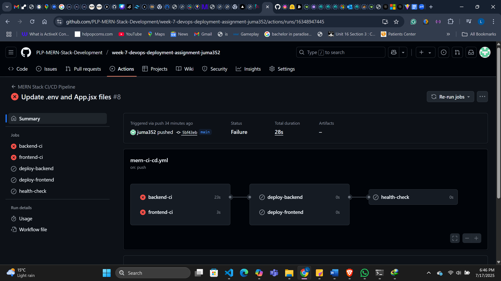

# Task Manager Application - Docker Deployment & Production Setup

## 🚀 Overview
Today we successfully transformed our MERN stack Task Manager application into a production-ready, containerized application with full Docker deployment capabilities. This comprehensive setup includes both backend and frontend services, MongoDB database, and all necessary configurations for seamless local development and production deployment.

## 📋 What We Accomplished Today

### 1. 🐳 Docker Containerization
**Complete Docker setup for all services:**
- **Backend API**: Node.js Express server containerized with Alpine Linux
- **Frontend**: React application built and served via Nginx
- **Database**: MongoDB 6.0 with persistent data storage

### 2. 🏗️ Infrastructure Setup

#### Docker Compose Configuration (`docker-compose.yml`)
- **Multi-service architecture** with 3 containers:
  - `mongodb`: MongoDB database with authentication
  - `backend`: Express.js API server
  - `frontend`: React application served by Nginx
- **Port mappings**:
  - Backend: `5000:5000`
  - Frontend: `3000:80`
  - MongoDB: `27017:27017`
- **Environment variables** for secure configuration
- **Volume mounts** for persistent data and logs
- **Health checks** for all services

#### Backend Dockerfile (`server/Dockerfile`)
- **Multi-stage build** with Node.js 18 Alpine
- **Production optimizations**:
  - Only production dependencies installed
  - Security-focused base image
  - Health check endpoint
  - Proper logging setup

#### Frontend Dockerfile (`client/Dockerfile`)
- **Two-stage build process**:
  - Build stage: Node.js for React build
  - Serve stage: Nginx Alpine for static file serving
- **Nginx configuration** with:
  - Security headers (XSS, CSRF protection)
  - Gzip compression
  - Static asset caching
  - SPA routing support

### 3. 🔧 Configuration Files Created

#### Nginx Configuration (`client/nginx.conf`)
- **Security headers** implementation
- **Gzip compression** for performance
- **Static asset caching** (1 year for images, CSS, JS)
- **SPA routing** support with try_files directive

#### Environment Configuration
- **MongoDB authentication** setup
- **JWT secret** configuration
- **CORS** properly configured
- **Rate limiting** implemented (100 requests per 15 minutes)

### 4. 🛡️ Security Enhancements
- **Helmet.js** for security headers
- **Rate limiting** on API endpoints
- **CORS** properly configured for production
- **MongoDB authentication** with username/password
- **JWT token-based** authentication system
- **Input validation** and sanitization

### 5. 📊 Monitoring & Health Checks
- **Health check endpoints** for all services:
  - Backend: `/health`
  - Frontend: Nginx health checks
  - MongoDB: Built-in health monitoring
- **Logging** setup with Winston
- **Error handling** middleware
- **404 route handling**

### 6. 🔄 API Endpoints Created
- **Authentication routes**:
  - `POST /api/auth/register` - User registration
  - `POST /api/auth/login` - User login
  - `POST /api/auth/logout` - User logout
- **Task management routes**:
  - `GET /api/tasks` - Get all user tasks
  - `POST /api/tasks` - Create new task
  - `PUT /api/tasks/:id` - Update task
  - `DELETE /api/tasks/:id` - Delete task
  - `PATCH /api/tasks/:id/complete` - Toggle task completion

### 7. 🎨 Frontend Features
- **Responsive design** with Tailwind CSS
- **Dark/light theme** toggle
- **Protected routes** with authentication
- **Task management** interface:
  - Create, read, update, delete tasks
  - Mark tasks as complete/incomplete
  - Filter tasks by status
- **User authentication**:
  - Registration form
  - Login form
  - JWT token management
- **Error boundaries** for graceful error handling

## 🚀 Quick Start Guide

### Prerequisites
- Docker and Docker Compose installed
- Git (for version control)

### Local Development Setup
```bash
# Clone the repository
git clone [your-repo-url]
cd task-manager-app

# Start all services
docker-compose up -d

# View logs
docker-compose logs -f

# Stop all services
docker-compose down
```

### Access Points
- **Frontend**: http://localhost:3000
- **Backend API**: http://localhost:5000
- **API Documentation**: http://localhost:5000/api
- **Health Check**: http://localhost:5000/health
**Live**: https://week-7-devops-deployment-assignment-omega.vercel.app/


### Environment Variables
Create `.env` files for local development:
```bash
# Server/.env
NODE_ENV=development
PORT=5000
MONGODB_URI=mongodb://localhost:27017/taskmanager
JWT_SECRET=your-secret-key
CLIENT_URL=http://localhost:3000

# Client/.env
VITE_API_URL=http://localhost:5000/api
```

## 📁 Project Structure
```
task-manager-app/
├── client/                 # React frontend
│   ├── Dockerfile
│   ├── nginx.conf
│   └── src/
│       ├── components/     # Reusable components
│       ├── Pages/         # Page components
│       └── services/      # API services
├── server/                # Express backend
│   ├── Dockerfile
│   ├── server.js
│   ├── routes/           # API routes
│   ├── controller/       # Route controllers
│   └── middleware/       # Custom middleware
├── docker-compose.yml     # Docker orchestration
└── README.md
```

## 🔍 Development Commands

### Docker Commands
```bash
# Build and start all services
docker-compose up --build

# View specific service logs
docker-compose logs backend
docker-compose logs frontend
docker-compose logs mongodb

# Execute commands in containers
docker-compose exec backend npm run dev
docker-compose exec frontend npm run dev

# Clean up
docker-compose down -v
```

### Database Management
```bash
# Access MongoDB shell
docker-compose exec mongodb mongosh -u admin -p password

# Backup database
docker-compose exec mongodb mongodump --username admin --password password --out /backup

# Restore database
docker-compose exec mongodb mongorestore --username admin --password password /backup
```

## 🌐 Production Deployment
https://week-7-devops-deployment-assignment-omega.vercel.app/


- [ ] Set up CI/CD pipeline with GitHub Actions

- [ ] Configure SSL certificates
- [ ] Set up monitoring with Prometheus/Grafana
- [ ] Implement automated backups
- [ ] Add performance optimization
- [ ] Set up staging environment

## 🤝 Contributing
1. Fork the repository
2. Create a feature branch
3. Make your changes
4. Add tests
5. Submit a pull request

## 📞 Support
For questions or issues, please open an issue on GitHub or contact the development team.

---
**Built with ❤️ using MERN stack and Docker**
